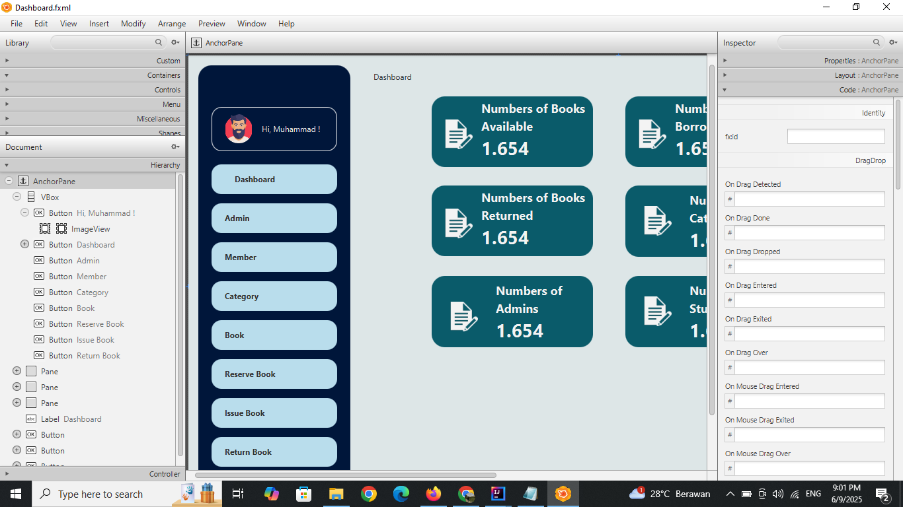

# 1. Inheritance:
pada folder model terdapat file java Person-Admin-Member. Person.java sebagai class induk sementara admin.java dan member.java sebagai class turunannya. 

Alasan: Karena pada admin dan member memiliki atribut yang sama yaitu atribut nama, email dan nomor hp, sehingga sebaiknya dibuat 1 class induk yg merepresentasikan keduanya yaitu class induk Person yg memiliki atribut nama, email dan nomor hp. anak class admin dan member hanya perlu mengextends person sehingga kedua turunan class tsb memiliki atribut yg sama denan person.

# 2. Encapsulation 
Buka Folder Model, di file Book.java.
Encapsulation adalah menyembunyikan detail implementasi dari luar kelas dan hanya menyediakan akses melalui metode tertentu (getter/setter).
Contoh menyembunyikan di Book.java:
```
    private String id;
    private String title;
    private String category;
    private String author;
    private String released;
    private String photo;
    private CheckBox select;
```
karena private, sehingga tersembunyi dan hanya dapat diakses melalui getter, contohnya:
```
public String getId() {
        return id;
    }

    public String getTitle() {
        return title;
    }

    public String getCategory() {
        return category;
    }

    public String getAuthor() {
        return author;
    }

    public String getReleased() {
        return released;
    }

    public String getPhoto() {
        return photo;
    }

    public CheckBox getSelect() {
        return select;
    }
```

# 3. Polymorphism
- Buka folder Model,  file Member.java
- Polymorphism = Nama fungsi/constructorya sama, tetapi parameter dan isi nya beda.
- Contohnya pada file Member.java tersebut pada:
```
    public Member(String id, String name, String email, String phone, String department, String photo) {
        super(name, email, phone);
        this.id = id;
        this.department = department;
        this.photo = photo;
        this.select = new CheckBox();
    }

    // Untuk ngambil data dari ReserveDb
    public Member(String name, String email, String phone, String department, String photo){
        super(name, email, phone);
        this.department = department;
        this.photo = photo;

    }
```
- Constructor Member pertama, digunakan untuk menampilkan data ke tabel, karena datanya lengkap
- Sementara yg kedua, digunakan pada Saat peminjaman buku, ketika admin menginput id member, maka sistem akan mencari data berdasarkan id nya, sehingga parameter constructornya tidak perlu ID

# 4. Adapter
- Masalah yg akan diselesaikan: Permasalahan terkait mencetak bukti peminjaman dan barcode buku.
- Adapter = Class Gabungan antara interface dan class
- Interfacenya terdapat pada folder Model, file Printer
- Classnya terdapat pada folder adapter, pada file ThermalPrinterAdapter.

- Cara kerja:
1. Pertama, Interface Printer, akan diisi dengan fungsi-fungsi yang dapat dijalankan oleh printer
  ```
  public interface Printer {
    void printText(String idPeminjaman, String nama, String nim, String tanggalPinjam, String tenggat, java.util.List<?> books) throws Exception;
    void printBarcode(String id) throws Exception;
}

  ```
2. Kedua, Buat class yg mengimplementasikan interface tsb, sehingga classnya wajib membuat nama fungsi yang ada pada interface:
```
public void printText(String idPeminjaman, String nama, String nim, String tanggalPinjam, String tenggat, List<?> books) throws Exception {
        StringBuilder sb = new StringBuilder();

        sb.append((char) 27).append((char) 97).append((char) 1); // Center
        sb.append("PERPUSTAKAAN\n========================\n\n");
        sb.append((char) 27).append((char) 97).append((char) 0); // Left
        //dan seterunya...
}
@Override
    public void printBarcode(String id) throws Exception {
        ByteArrayOutputStream outputStream = new ByteArrayOutputStream();
        outputStream.write(new byte[]{0x1B, 0x61, 0x01});
 //dan seterunya...
}
```

# 5. Composite
- Penerapan composite ada di setial file .fxml.
- Misalnya pada file dashboard.fxml
- setiap komponen grafis terdiri dari hierarkis. Misalnya pada sidebar tersusun atas elemen paling dasar yaitu, anchor pane, lalu ada vbox dan di dalamnya terdapat button. 
Jadi cara membuktikannya, kalau vbox di hapus, maka semua tombol di dalam vbox akan hilang.
- Gambar struktur hierarkisnya:


Screenshot (1943).png
# 6. Decorator
Ada pada reserveController

# 7. Thread
Pada reserveCOntroller.java. Jadi saat mengeprint dilakukan di latar belakang  sehingga sistem tidak perlu menunggi prose print selesai untuk melakukan aktovitas lainnya

# 8. Singleton
Penerapannya di setiap file di folder Database, pada tiap fungsi diawali db.getConnection();
Dan diakhir fungsi terdapat db.closeConnection(); artinya, setelah fungsi dijalankan, maka akses di database diputus agar database diakses pada saat diperlukan saja (saat fungsi dijalankan).
